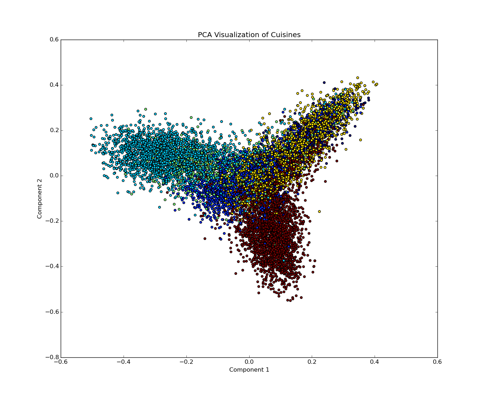
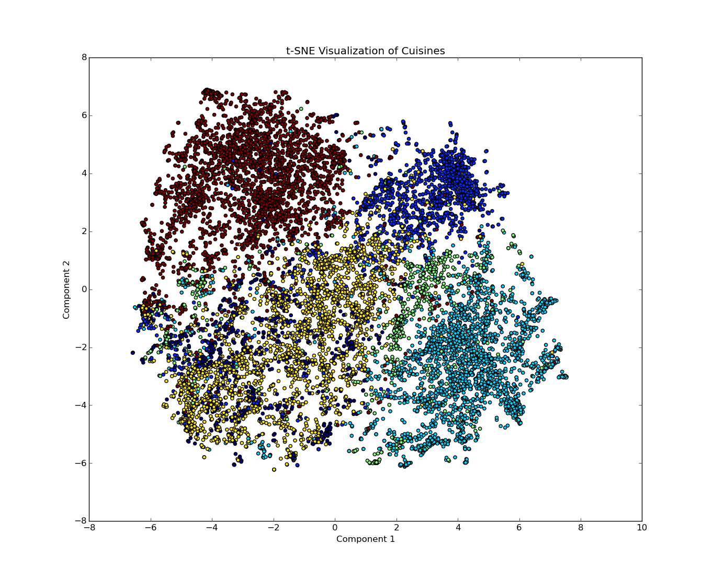
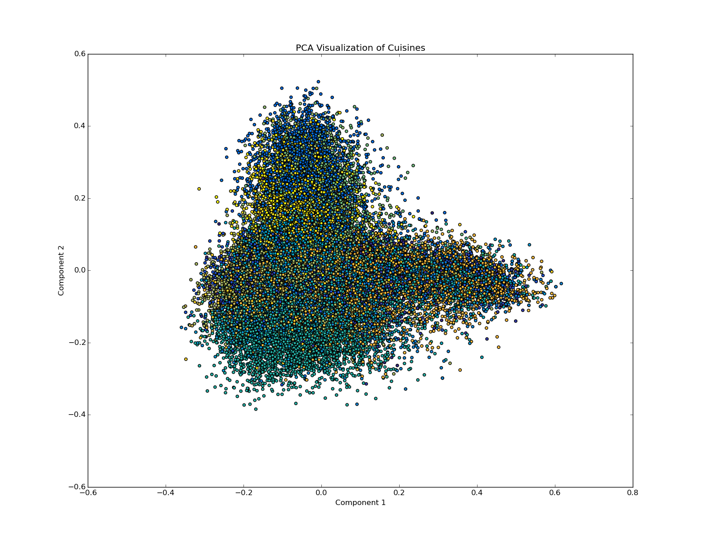
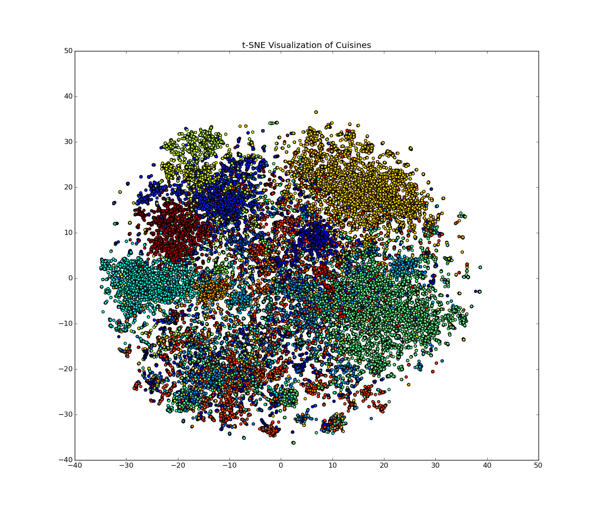

# What's Cooking?
ENGS 104 Group repo on Kaggle's "What's Cooking?" challenge.

## Highlights
I performed some dimensionality analysis on the data in order to visualize the cuisines. I used both **Principal Component Analysis (PCA)** and the **t-Distributed Stochastic Neighbor Embedding (t-NSE)**. See some of the visualizations below:

### Limited Classes
PCA: 
t-SNE: 

### All Classes
PCA: 
t-SNE: 
